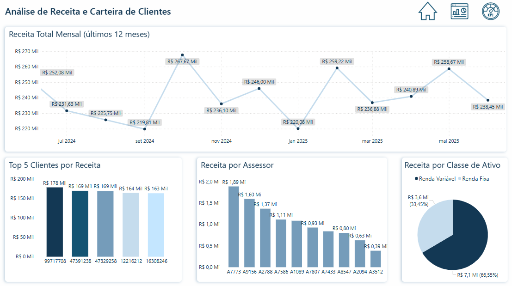

# 🏦 Desafio de Automação e Análise de Dados — Assessoria de Investimentos

Este projeto foi desenvolvido como parte de um processo seletivo, com o objetivo de simular atividades de rotina em uma assessoria de investimentos. Os dados utilizados são fictícios e o desafio visava testar habilidades técnicas em **análise de dados**, **automação** e **visualização**.

## 📑 Descrição do Desafio

O desafio foi dividido em 5 etapas principais, além de um bônus de automação:

1. **Receita Total Mensal:** Análise da receita consolidada nos últimos 24 meses.
2. **Receita por Classe de Ativo:** Visualização do comportamento da receita por classe de ativo.
3. **Base de Clientes por Perfil:** Identificação dos clientes com perfil **Private** (volume ≥ R$3 milhões), seus assessores e a receita média desse grupo.
4. **Clientes com Receita Decrescente:** Detecção de clientes cuja receita caiu por três meses consecutivos.
5. **Dashboard Interativo:** Criação de uma dashboard no Power BI com:
   - Receita total mensal
   - Top 5 clientes por receita
   - Receita por classe de ativo
   - Receita por assessor
   - Página exclusiva com KPIs (Receita total, Receita média por cliente, Clientes Private, Receita dos Private, Receita média por assessor e Total de assessores)

### 🔥 Desafio Extra (Bônus)

Automatização da geração de relatórios individuais em PDF para cada cliente, contendo:

- Nome do cliente
- Assessor responsável
- Mês
- Volume alocado
- Receita

Os relatórios foram entregues compactados em `.zip`.

---

## 🧠 Tecnologias Utilizadas

- **Python** (Pandas, Matplotlib, Seaborn, FPDF, Zipfile)
- **Power BI**
- **Power Query**
- **Jupyter Notebook**
- **Excel / Google Sheets (para limpeza inicial)**

---

## 📂 Estrutura do Projeto

```
desafio_assessoria_investimentos/
├── base/ # Base de dados utilizada no projeto
├── dashboard/ # Arquivos e imagens da dashboard
├── notebook/ # Código em Python no Jupyter
├── pdfs_amostra/ # Exemplos de PDFs gerados
├── zip/ # Arquivo .zip com todos os PDFs
└── README.md # Documentação do projeto
```


---

## 🔧 Ferramentas e Tecnologias

- Python (Pandas, Matplotlib, Seaborn, FPDF)
- Power BI
- VS Code + Jupyter Notebook
- Git e GitHub

---

## 📊 Dashboard no Power BI

O dashboard foi construído para responder às principais perguntas de negócio, distribuído em abas:

- **Home:** Apresentação, logo e navegação.
- **Análises:**  
    - Receita Total Mensal  
    - Top 5 Clientes por Receita  
    - Receita por Classe de Ativo  
    - Receita por Assessor
  - **KPIs:** Indicadores chave como Receita Total, Receita Média por Cliente, Nº de Clientes Private, Receita Private, Receita Média por Assessor e Total de Assessores.

<p align="center">
  
</p>

---

## 🐍 Automação em Python

Foi criada uma automação que gera um **relatório em PDF para cada cliente**, contendo:

- Cliente
- Assessor
- Volume Alocado
- Receita
- Informações mês a mês

Todos os relatórios estão compactados em um único arquivo `.zip`.

---

## 📥 Como Rodar o Projeto

### ✅ Notebook

1. Clone este repositório.
2. Instale as dependências necessárias (Pandas, FPDF, Matplotlib, etc.).
3. Abra o arquivo `notebook/desafio.ipynb` no Jupyter ou VS Code.
4. Execute as células para gerar as análises e os PDFs.

### ✅ Dashboard Power BI

1. Abra o arquivo `.pbix`
2. A base de dados `base/base_desafio_limpa.xlsx` está organizada para conectar diretamente.

---

## 🚀 Resultado Final

- 🔗 [Link do Power BI Publicado](https://app.powerbi.com/view?r=eyJrIjoiM2E4NWI5YTYtOTFjYy00ODc4LWJiYmItNDQ3ZGU0OWQxZDU5IiwidCI6ImYxZjVmZTNjLTA5MzQtNDE3Yy1hMDMzLWU0ZGExYzk2ZmNiNCJ9)
- 🔗 [Repositório no GitHub](https://github.com/gilmar-csantos/desafio_assessoria_investimentos)

---

## 🧠 Aprendizados

Este projeto me proporcionou:

- Prática em ETL e análise de dados.
- Criação de dashboards profissionais no Power BI.
- Desenvolvimento de automações em Python para geração de relatórios.
- Aplicação de melhores práticas na organização de projetos de dados.

---

## 🤝 Contato

- **Gilmar Santos**  
[](https://www.linkedin.com/glmrsnts/)  
✉️ costasantos.gilmar@gmail.com

---
